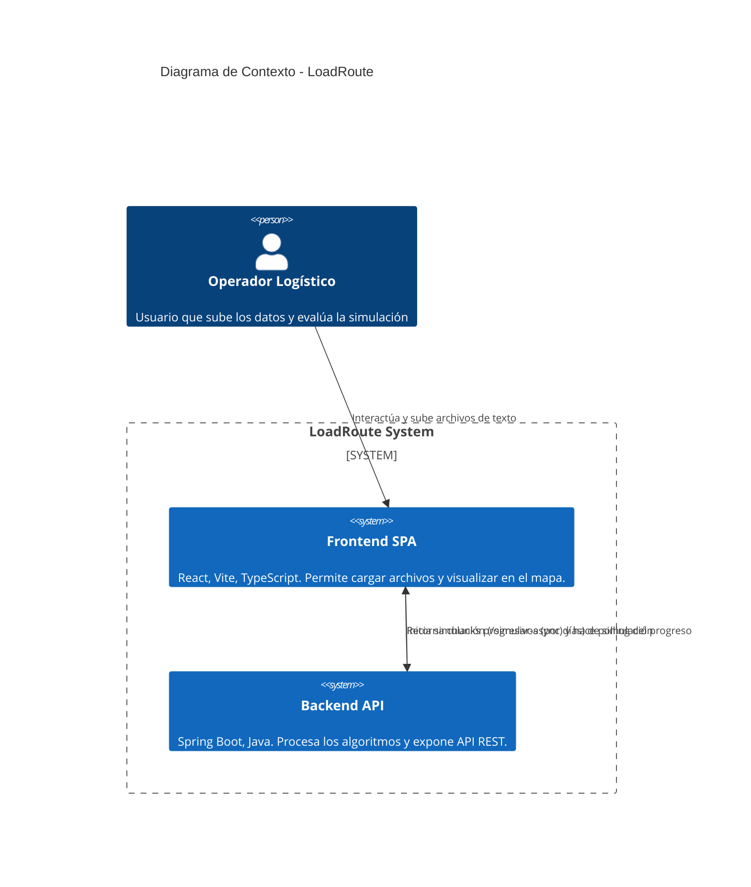

# Diseño de Arquitectura de Solución (v01)

## 1. Propósito y Contexto del Sistema
El sistema LoadRoute tiene como objetivo proporcionar una plataforma de simulación y optimización de rutas logísticas y capacidad de almacenamiento en aeropuertos. Utiliza algoritmos heurísticos (Simulated Annealing y ALNS) para evaluar y mejorar la distribución de paquetes a través de una red de vuelos.

## 2. Diagrama de Arquitectura (C4 Model - Nivel Contexto/Contenedor)
El siguiente diagrama muestra la interacción a alto nivel entre el usuario, el sistema de Frontend (Interfaz Gráfica) y el Backend (Motor de Optimización).

## 3. Stack Tecnológico
* **Frontend:** React.js con Vite, escrito en TypeScript. Utiliza Mapbox para la visualización geoespacial de la red de aeropuertos y el flujo de los vuelos.
* **Backend:** Java 17, Spring Boot 3. Arquitectura basada en servicios sin persistencia en base de datos tradicional, gestionando toda la red logística en memoria de forma transitoria durante la ejecución de los algoritmos.

## 4. Patrones y Estilo Arquitectónico
* **Cliente-Servidor Asíncrono:** Clara separación entre el cliente web interactivo y el servidor de procesamiento pesado. Se emplea un patrón de *Polling* para consultar el progreso del Job de Simulación.
* **Procesamiento en Memoria (In-Memory Processing):** Debido al requisito estricto de optimización (procesar múltiples iteraciones en poco tiempo), el sistema carga todos los grafos en estructuras de datos rápidas (`HashMap` y Colecciones) y evita el alto costo de I/O.
* **Procesamiento por Lotes Temporales (Chunking con Persistencia de Estado):** El volumen masivo de datos se divide por días de operación. El backend procesa un día, envía la respuesta al frontend como un *chunk* progresivo, y mantiene en memoria el estado mutado de las capacidades de los vuelos para el procesamiento del siguiente día. Esto asegura continuidad temporal (los SLA de 48h cruzan la barrera de medianoche sin perderse).
* **Aislamiento de Entornos Algorítmicos:** Para realizar comparaciones objetivas (benchmarks), el backend instancia copias profundas e independientes de la red de vuelos (y su estado de ocupación) para Simulated Annealing y ALNS, evitando la contaminación cruzada del estado mutable durante la ejecución paralela o secuencial de los heurísticos.
