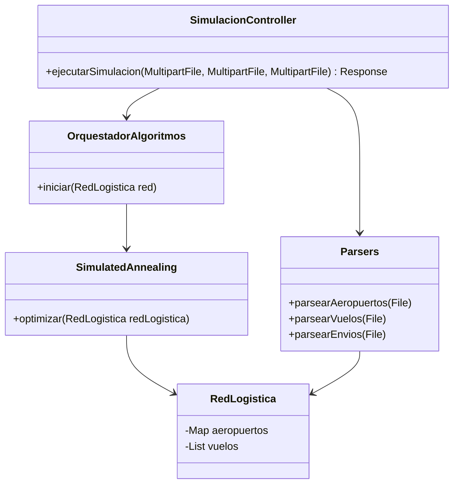

# Diseño a Nivel de Componentes (v01)

## 1. Componentes del Frontend (React)
El frontend se organiza en componentes funcionales independientes y hooks para abstraer el estado global de la simulación de manera mantenible.
* **`useLoadRoute`:** Hook personalizado que orquesta el estado de la aplicación. Maneja el envío de formularios multi-parte a la API, recibe la respuesta JSON del servidor y procesa el "tick" o paso del tiempo para la animación del dashboard.
* **`MapaRutas`:** Componente encargado de renderizar la topología con la librería de mapas interactivos.
* **`ControlPanel` / `Sidebar`:** Interfaz de usuario para la manipulación de la carga de archivos.

## 2. Componentes del Backend (Java / Spring Boot)
El backend emplea una separación en capas (Controlador web, Servicio de negocio, Procesamiento Algorítmico).

* **`SimulacionController`:** Expone el endpoint principal RESTful (`/api/simulacion/ejecutar`). Deserializa los archivos cargados y devuelve el objeto completo resultante.
* **`OrquestadorAlgoritmos`:** Clase de servicio principal. Coordina la inicialización de la red y delega la responsabilidad a las heurísticas de optimización paso por paso.
* **`Parsers`:** Módulo dedicado a leer las líneas de texto plano, construir objetos y poblarlos. Maneja el formato rígido del cliente y lanza errores de formato.

## 3. Motor Algorítmico (Simulated Annealing & ALNS)
El motor principal del dominio del sistema. Evalúa y modifica los nodos lógicos buscando el menor costo (penalización).
* **`SimulatedAnnealing`:** Componente que controla la "temperatura global" y la probabilidad de aceptar rutas peores temporalmente para escapar de mínimos locales.
* **Validadores de Restricción:** Modificadores de costo que penalizan sobrecargas de aeropuertos, descontando los paquetes que han llegado a su "destino final".

## 4. Diagrama de Componentes (UML)

