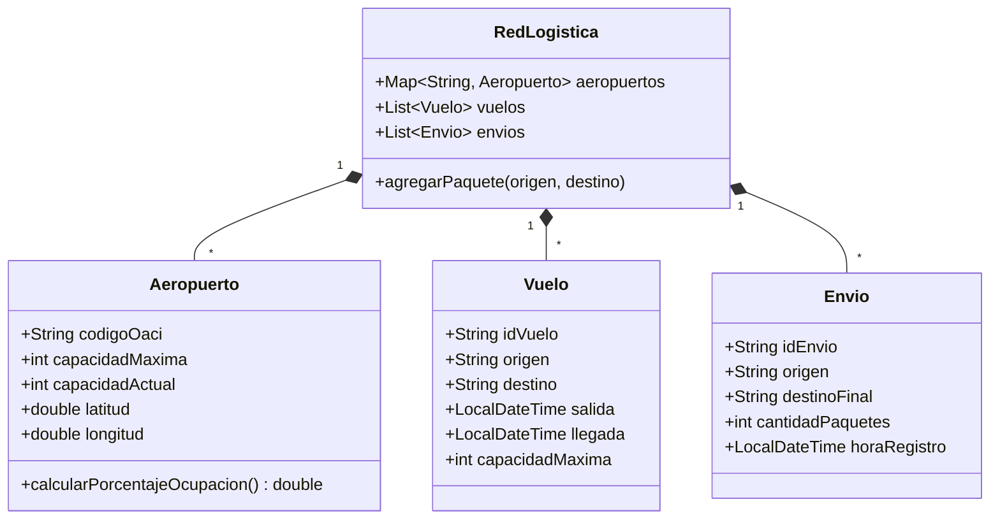

# Diseño de Estructura de Datos (v01)

## 1. Entidades del Dominio (Modelos de Memoria)
El sistema actual prescinde de una base de datos relacional para la ejecución directa de la simulación con el fin de priorizar la velocidad en miles de iteraciones algorítmicas. El modelo de dominio principal se instancia en la memoria RAM (JVM).

* **Aeropuerto:** Representa un nodo físico de tránsito en la red logística.
  * `codigoOaci` (String, actuando como PK lógica, ej. "SPJC")
  * `capacidadMaxima` (int)
  * `capacidadActual` (int)
  * *Nota de Diseño:* El aeropuerto final de un paquete no suma a la capacidad de tránsito actual para efectos de sobrecosto en penalización.
* **Vuelo:** Representa una arista direccional en el tiempo, uniendo dos nodos.
  * `idVuelo` (String)
  * `origen`, `destino` (Claves de Aeropuerto OACI)
  * `horaSalida`, `horaLlegada` (Estructuras de Fechas ISO / LocalDateTime)
  * `capacidad` (int)
* **Envio / Paquete:** El ítem físico a distribuir y rutear a lo largo de la red de nodos.
  * `idEnvio` (String)
  * `origen`, `destinoFinal`
  * `cantidadPaquetes`

## 2. Diagrama de Clases UML del Dominio Central

## 3. Estructuras de Datos Orientadas al Rendimiento
Para satisfacer los requerimientos temporales del `SimulatedAnnealing` y `ALNS`, se recurre a estructuras específicas:
* **Mapas Asociativos (HashMaps):** Colecciones principales configuradas como `Map<String, Aeropuerto>` utilizando `codigoOaci` como llave. Garantiza complejidad espacial O(N) y de búsqueda en tiempo amortizado `O(1)`, evitando escaneos lineales.
* **Estructuras Mutables y Copia Profunda (Aislamiento Algorítmico):** Para garantizar un benchmark fiable, la entidad `Vuelo` implementa un método `clonar()` (Patrón Prototype) que realiza una copia profunda independiente. Las operaciones de ruteo de SA y ALNS afectan a sus propias copias, permitiendo ejecución competitiva y simultánea sin sobrescribir el estado `capacidadActual`.

## 4. Gestión de Estado Asíncrono y Chunking (DTO)
Para soportar la simulación progresiva a gran escala (Día a Día), se introducen estructuras transitorias:
* **SimulacionSession:** Un diccionario en memoria (`ConcurrentHashMap<String, SimulacionJobDTO>`) gestionado por `RuteoAsyncJobService` que actúa como contenedor transitorio. Aloja las referencias al grafo clonado de vuelos y administra el ciclo de vida del hilo asíncrono, persistiendo la capacidad mutada entre los *chunks* diarios sucesivos.
* **SimulacionJobDTO:** El objeto de transferencia de datos ha sido adaptado. En lugar de un solo `RutaResponseDTO`, gestiona una colección `List<RutaResponseDTO> chunks`, permitiendo al frontend realizar *polling* y reconstruir progresivamente la línea de tiempo.
